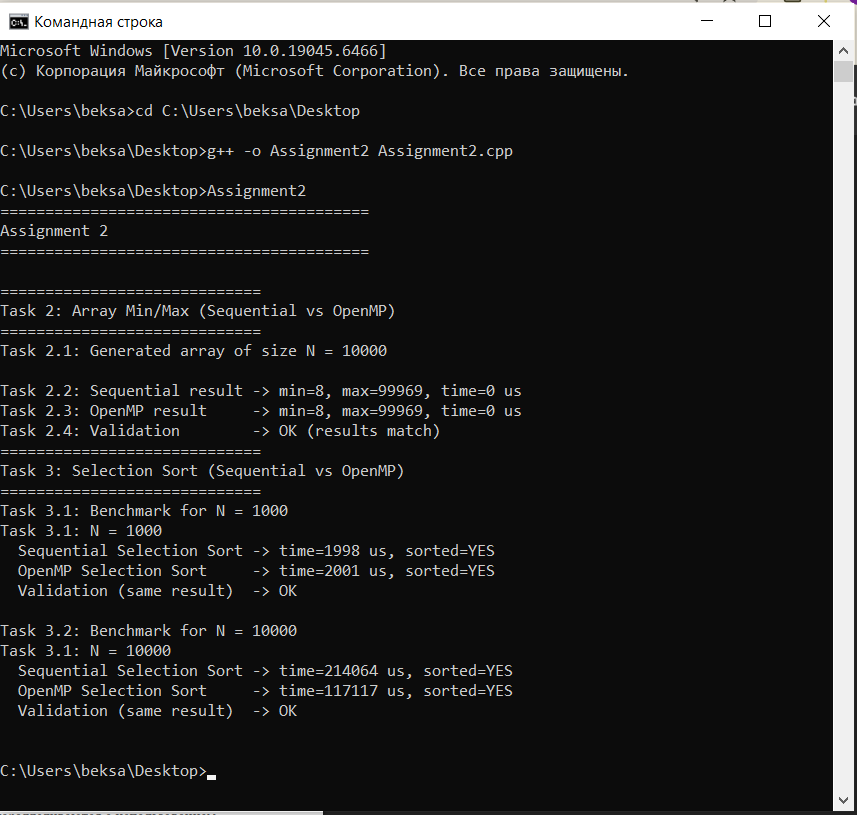
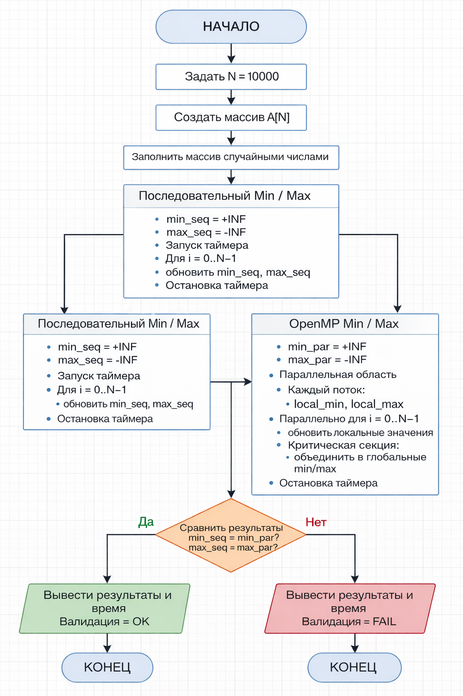
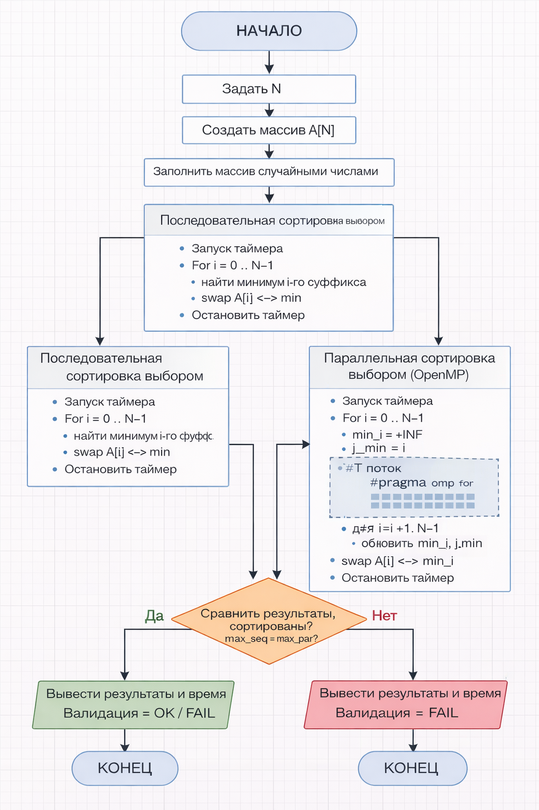

# Assignment 2

## Задача 1. Введение в гетерогенную параллелизацию (теория)

Гетерогенная параллелизация представляет собой подход к организации вычислений, при котором в рамках одной программы используются различные типы вычислительных устройств, чаще всего центральный процессор (CPU) и графический процессор (GPU). Основная идея данного подхода заключается в том, что каждому устройству передаются те задачи, для которых оно наиболее эффективно, что позволяет повысить общую производительность системы.

Архитектура CPU ориентирована на выполнение сложных последовательных операций и задач с большим количеством ветвлений. Центральный процессор содержит ограниченное число мощных ядер, каждое из которых способно эффективно выполнять разнообразные инструкции. Благодаря этому CPU хорошо подходит для управления программой, обработки логики и выполнения задач с высокой степенью зависимости между операциями.

В отличие от CPU, GPU содержит тысячи простых вычислительных ядер и оптимизирован для выполнения большого количества однотипных операций над массивами данных. GPU работает по принципу SIMD (одна инструкция — множество данных), что делает его особенно эффективным для задач численного моделирования, обработки изображений и машинного обучения.

Преимущество гетерогенной параллелизации заключается в более полном использовании аппаратных ресурсов. Такой подход позволяет значительно ускорить вычисления, повысить масштабируемость приложений и добиться лучшей производительности по сравнению с использованием только CPU или только GPU.

Гетерогенные вычисления широко применяются в реальных задачах, включая машинное обучение, компьютерное зрение, физическое и климатическое моделирование, биоинформатику, а также в современных игровых и графических движках.

---

## Задача 2. Работа с массивами и OpenMP

В рамках второй задачи была разработана программа на языке C++, демонстрирующая использование OpenMP для параллельной обработки данных. Программа создаёт массив из 10 000 случайных целых чисел, после чего выполняет поиск минимального и максимального элементов сначала в последовательном режиме, а затем с использованием параллельных директив OpenMP.

Для хранения данных используется контейнер `std::vector<int>`. В последовательной версии алгоритм выполняется в одном потоке, последовательно проходя по всем элементам массива. В параллельной версии используется директива `#pragma omp parallel`, в рамках которой каждый поток вычисляет локальные значения минимума и максимума. Полученные локальные результаты затем объединяются в глобальные значения с использованием критической секции.

Для измерения времени выполнения используется библиотека `std::chrono`. В ряде запусков время выполнения оказывается равным 0 микросекунд, что объясняется малым объёмом данных и высокой скоростью выполнения операций, превышающей разрешающую способность измерений.

Результаты выполнения программы представлены на скриншоте:

Анализ результатов показывает, что при небольшом размере массива накладные расходы, связанные с управлением потоками OpenMP, могут нивелировать потенциальный выигрыш в производительности. Однако при увеличении объёма данных параллельная реализация может демонстрировать более высокую эффективность.

---

## Задача 3. Параллельная сортировка выбором с OpenMP

В третьей задаче реализован алгоритм сортировки выбором (Selection Sort) в двух вариантах: последовательном и частично параллельном с использованием OpenMP. Тестирование производительности выполнялось для массивов размером 1 000 и 10 000 элементов.

Алгоритм сортировки выбором имеет выраженные зависимости между итерациями внешнего цикла, поэтому его невозможно полностью распараллелить. В реализованной версии параллелизация применяется только к внутреннему циклу поиска минимального элемента. Для этого каждый поток вычисляет локальный минимум, после чего результаты объединяются в критической секции.

Результаты выполнения и измерения времени представлены на следующем скриншоте:

Анализ показывает, что для массива из 1 000 элементов ускорение отсутствует из-за накладных расходов на параллелизацию. Для массива из 10 000 элементов наблюдается уменьшение времени выполнения, однако масштабируемость алгоритма остаётся ограниченной. Это связано с тем, что внешняя часть алгоритма остаётся последовательной, что соответствует закону Амдала.

---

## Контрольные вопросы 
### 1. Что понимается под гетерогенной параллелизацией?
Использование нескольких типов вычислительных устройств (CPU, GPU) в одной программе для повышения производительности.

---

### 2. В чём принципиальные различия архитектур CPU и GPU?
CPU оптимизирован для сложной логики и управления, GPU — для массовых параллельных вычислений.

---

### 3. Какие типы задач лучше подходят для GPU, а какие — для CPU?
GPU — задачи с большими массивами данных и однотипными операциями.  
CPU — задачи с ветвлениями, логикой и управлением.

---

### 4. Почему не все алгоритмы эффективно распараллеливаются с OpenMP?
Из-за зависимостей между итерациями, критических секций и последовательных частей алгоритма.

---

### 5. В чём заключается основная идея алгоритма сортировки слиянием?
Рекурсивное разбиение массива на части, их сортировка и последующее слияние.

---

### 6. Какие сложности возникают при реализации сортировки слиянием на GPU?
Синхронизация потоков, управление памятью, эффективное параллельное слияние.

---

### 7. Как выбор размера блока и сетки влияет на производительность GPU?
Он определяет загрузку GPU, использование памяти и степень параллелизма.

---

### 8. Почему гетерогенный подход может быть эффективнее CPU или GPU по отдельности?
Потому что каждая архитектура используется для задач, в которых она наиболее эффективна.

---
